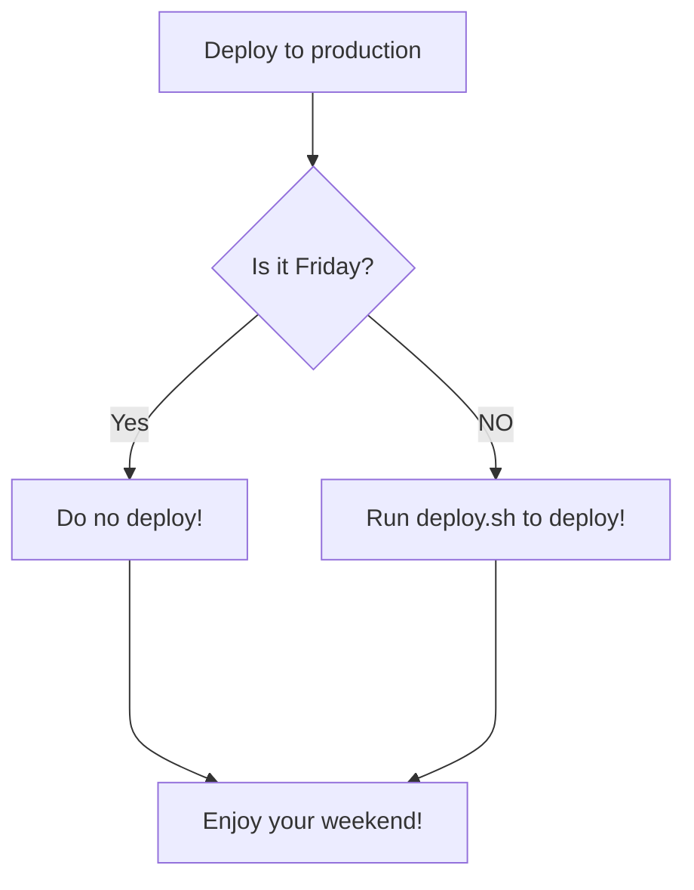
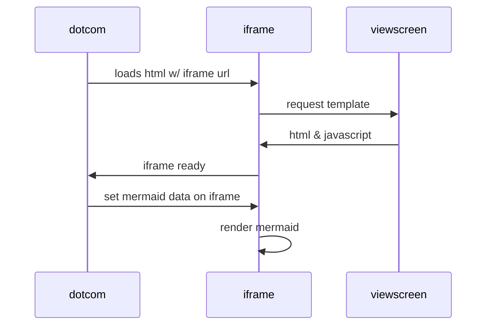
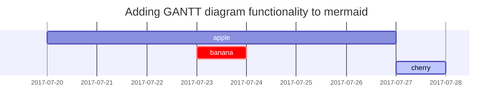

근디 와 저자가 안나오노

# 제목1
## 제목2 / toc에 뜸
### 제목3 / toc에 뜸
#### 제목4

<h1 data-toc-skip>H1 - 제목 이렇게도 쓸 수 있다</h1>
<h2 data-toc-skip>H2 - heading</h2>
<h3 data-toc-skip>H3 - heading</h3>
<h4>H4 - heading</h4>

**Bold**
_Italic_
<kbd>키보드 모양</kbd>

글자랑 띄운채로 대쉬 세개 하면 굵은 구분선

---

글자랑 딱 붙인채로 대쉬 세개 하면 얇은 구분선 근데 글자도 커짐 / toc에 뜸
---

## Lists

### Ordered list
1. Firstly
2. Secondly
3. Thirdly

### Unordered list
- Chapter
  + Section
    * Paragraph

### ToDo list
- [ ] Job
  + [x] Step 1
  + [x] Step 2
  + [ ] Step 3

### Description list
Sun
: the star around which the earth orbits
Moon
: the natural satellite of the earth, visible by reflected light from the sun

Star
: Burning sphere in space

## Block Quote
> This line shows the _block quote_.

## Prompts
> An example showing the `tip` type prompt.
{: .prompt-tip }
> An example showing the `info` type prompt.
{: .prompt-info }
> An example showing the `warning` type prompt.
{: .prompt-warning }
> An example showing the `danger` type prompt.
{: .prompt-danger }

## Tables
테이블 위아래로 공백 안주면 짜그라진다

| Company                      | Contact          | Country |
|:-----------------------------|:-----------------|--------:|
| Alfreds Futterkiste          | Maria Anders     | Germany |
| Island Trading               | Helen Bennett    | UK      |
| Magazzini Alimentari Riuniti | Giovanni Rovelli | Italy   |

## Links
- <http://127.0.0.1:4000> 그냥 일반 링크
- [링크 키워드](hptts://google.com) 키워드 뒤에 붙은 링크는 안보임 / 띄어쓰기 가능
- [링크 키워드](#제목으로-이동가능) 제목 링크 가능, 근데 제목 사이사이 띄어쓰기에 대쉬-붙여줘야-함
- [링크 키워드][링크-url-키워드] 링크를 바로 안붙여쓰고 다른 곳에 선언해서 사용할 수 있음 / 띄어쓰기 안됨

## 제목으로 이동가능
[링크-url-키워드]: https://naver.com 링크 여기다 선언했는데 안보이쥐
링크 위에다 선언했는데 안보이고 그 옆에 글 쓴것도 안보이네


## Code

### 코드 작성방법(박스, 포맷설정)
```console
$ bash tools/init 코드 작성
```

### Specific filename  특정 이름 출력
```sass
@import
  "colors/light-typography",
  "colors/dark-typography"
```
{: file='_sass/jekyll-theme-chirpy.scss'}

### 한 줄 코드
`한줄코드`

### diff
```diff
- 빨간색 형광펜 칠해짐
- version: 1
+ 초록색 형광펜 칠해짐
```

### github 코드 참조
깃허브에 있는 코드 라인 참조 가능
[`src/app.yaml`{: .filepath}](https://github.com/googleanalytics/google-analytics-super-proxy/blob/master/src/app.yaml#L1-L2)

### filepath
`파일\패스\형식으로\출력하는건가.물음표`{: .filepath }


## image

{: width="700" height="400" }
_이미지 설명_
svg 파일은 너비 지정을 안해주면 렌더링 안됨
(다른 파일들은 크기지정 자유!)

라이트모드랑 다크모드랑 이미지를 다르게 출력할 수 있다.
{: .light }
{: .dark }


이미지에 그림자 효과를 줄 수 있다.
{: .shadow }


### [Mermaid](https://mermaid.js.org/)
이거는 나중에 필요할 때 차차 공부하도록 합시다..




#### Mermaid SVG


## Reference
이게 뭔가 했더니 각주네 각주야[^ga-filters]

[^ga-filters]: [Google Analytics Core Reporting API: Filters](https://developers.google.com/analytics/devguides/reporting/core/v3/reference#filters)

## 더 알아보기
For more knowledge about Jekyll posts, visit the Jekyll [Docs: Posts](https://jekyllrb.com/docs/posts/).